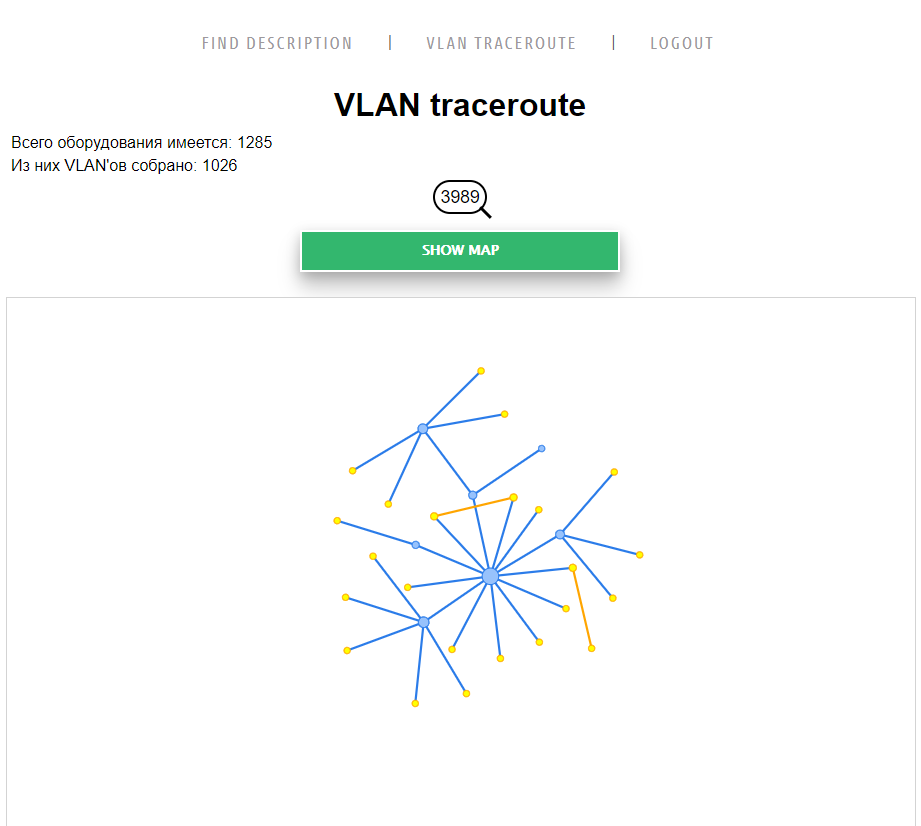

# Find Description - VLAN traceroute

---

Данное приложение является модулем для 
[Zabbix Devices Output](https://github.com/ig-rudenko/Zabbix-Devices-Output)

После того как данные интерфейсов либо VLAN'ов собраны с помощью [автоматического сбора ZDO](https://github.com/ig-rudenko/Zabbix-Devices-Output#%D0%B0%D0%B2%D1%82%D0%BE%D0%BC%D0%B0%D1%82%D0%B8%D1%87%D0%B5%D1%81%D0%BA%D0%B8%D0%B9-%D1%81%D0%B1%D0%BE%D1%80-%D0%B4%D0%B0%D0%BD%D0%BD%D1%8B%D1%85)
данный модуль обеспечит поиск по описанию портов, которые хранятся в файлах 

`/<zabbix-devices-output-path>/data/<device_name>/interfaces.yaml`

`/<zabbix-devices-output-path>/data/<device_name>/vlan.yaml`

## Установка

Скачиваем репозиторий и переходим в него

    git clone https://github.com/ig-rudenko/find_description.git && cd find_description

В файле `config` указываем полный путь до папки `zabbix-devices-output/data`, 
а также URL zabbix.

    [data]
    path=/full/path/zabbix-devices-output/data/
    zabbixurl=https://localhost/zabbix

Создаем образ docker

    docker image build -t find_descr:0.6 .

Запускаем

    docker-compose up -d

---

Подключаемся к серверу используя порт 8000

По умолчанию логин/пароль суперпользователя: root/password

